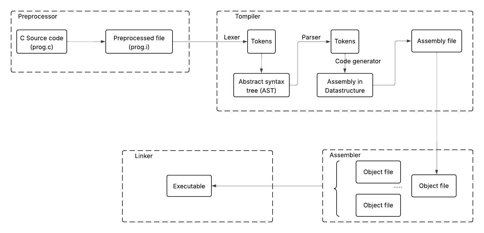

# High-level Architecture

## 4 stages of Tompiler
Tompiler will process source code in 4 stages

### Lexer
Lexer breaks up the source code into a list of tokens. Tokens are the smallest syntractic units of a program; they include delimiters, arithmetic symbols, keywords, and identifiers.

### Parser
Parser converts the list of tokens into an abstract syntax tree (AST), which represents the program in a form we can easily traverse and analyze

### Assembly generation
The assembly generation pass converts the AST into assembly. At this stage, we still represent the assembly instructions in a data structure that the compiler can understand, not as text

### Code emission
The code emission pass writes the assembly code to a file so the assembler and linker can turn it into an executable